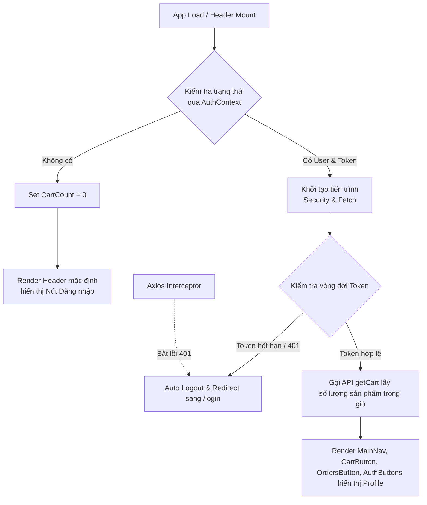

# Phân tích Flow Hoạt Động Component Header

## 1. Tổng quan
`Header` đóng vai trò là component cha (Container Component) quản lý trạng thái chung về xác thực, giỏ hàng, và điều hướng chính của toàn bộ trang web.

### Cây cấu trúc Component
- `Header` (Component cha)
  - `MainNav` (Navigation - chứa các link chính)
  - `ContactInfo` (Thông tin liên hệ)
  - `OrdersButton` (Nút chuyển đến danh sách đơn hàng)
  - `CartButton` (Nút giỏ hàng & badge số lượng)
  - `AuthButtons` (Auth & Profile - bao gồm Login/Logout/Hình đại diện dropdown)

---

## 2. Flow tổng thể

**Mô tả flow chi tiết:**
- **Khi app load → Header mount:** Trích xuất `user`, `token` và hàm `logout` từ `AuthContext`.
- **Kiểm tra user/token:** 
  - **Nếu có:** Thực hiện kiểm tra thời hạn của token. Nếu token còn hợp lệ, hệ thống sẽ thực thi API lấy số lượng sản phẩm trong giỏ hàng.
  - **Nếu không:** Thiết lập state `cartItemCount` về `0` và hiển thị UI ở trạng thái khách.
- **Xử lý token:** 
  - Hệ thống sử dụng interval ngầm định kỳ (mỗi 60s) để quét `jwtDecode` kiểm tra xem token đã hết hạn hay chưa.
  - Đăng ký thẻ `axios.interceptors` chặn tất cả response. Nếu hệ thống vô tình gọi API gặp lỗi `401 Unauthorized`, nó sẽ chuyển luồng trực tiếp đóng phiên bản thân.
- **Điều hướng (Auto Logout):** Cảnh báo hết phiên và dùng `useNavigate` điều hướng về trang `/login` ngay lúc đó.

---

## 3. Phân tích từng phần trong Header

### 3.1. MainNav (Navigation)
- **Props nhận vào:** `onViewProducts={handleViewProducts}`.
- **State/useEffect chính:** Không tự quản lý state vòng đời.
- **Logic xử lý:** Hiển thị thanh menu chính. Gắn event lên các nút điều hướng; khi trigger hàm từ Props, component dùng router để đẩy tiếp sang trang chứa sản phẩm (`/products`).
- **Điều kiện render:** Luôn luôn render.

### 3.2. Cart (CartButton & Hiển thị số lượng)
- **Props nhận vào:** `token`.
- **State/useEffect chính:** Do Header giữ state `cartItemCount` và gọi lại API `getCart` mỗi khi `user` có sự thay đổi (thông qua useEffect chính ở Header).
- **Logic xử lý:** Chuyển đổi sang giao diện Giỏ hàng hoặc mở modal mini. Hiển thị UI kèm badge biểu diễn con số tổng cộng đã tính toán (`reduce` ra tổng số `quantity`).
- **Điều kiện render:** Chỉ xuất hiện nếu user đã đăng nhập, tức là `{token && <CartButton token={token} />}`.

### 3.3. Orders (OrdersButton)
- **Props nhận vào:** Không.
- **Logic xử lý:** Gắn kèm link để điều hướng người dùng xem chi tiết lịch sử đơn hàng của bản thân.
- **Điều kiện render:** Luôn render ở vị trí Header (Component bên trong tự xử lý logic ẩn/hiện nếu cần thiết).

### 3.4. Auth & Profile (AuthButtons / Login prompt)
- **Props nhận vào:** `user`, `token`, `onAutoLogout={handleAutoLogout}`.
- **State/useEffect chính:** Quản lý state nhỏ bên trong để toggle (mở/đóng) drowdown profile avatar.
- **Logic xử lý:** 
  - Đóng vai trò **Profile Dropdown** khi được truyền vào prop `user` hợp lệ: Cho phép cập nhật profile, đăng xuất tài khoản.
  - Đóng vai trò **Login Prompt** khi prop `user="null"`: Trả về cụm nút "Đăng nhập" / "Đăng ký".
- **Điều kiện render:** Luôn render (hiển thị hình thái phụ thuộc vòng đời và dữ liệu của Prop).

---

## 4. Luồng dữ liệu (Data Flow)

- **Header nhận gì từ Context:**
  - Nhận `user`, `token`, và action `logout` từ **AuthContext**. Dùng hai state này định đoạt rẽ nhánh toàn bộ luồng Auth của ứng dụng.
- **Component nào gọi API, component nào dùng context:**
  - `Header` đóng vai trò là "Bộ não". Tự bản thân Header gọi API `getCart` (thông qua token) để cập nhật state. Header cũng tích cực lắng nghe dữ liệu Context từ ứng dụng (Consumer của AuthContext).
- **Truyền props xuống Component con:** 
  - Prop-drilling nhẹ nhàng xuống component con (`MainNav`, `CartButton`, `AuthButtons`) các thông tin cốt lõi nhất (Token cho bảo mật, User để hiển thị avatar, sự kiện `onAutoLogout` từ interceptor đẩy xuống). Do vậy component con khá "dumb" và dễ dàng test/tái sử dụng.

---

## 5. Xử lý Auth & Token (Security Mechanism)

Cơ chế chặn Token rất chặt chẽ và tập trung toàn diện trong Header.
1. **Kiểm tra Token định kỳ (Interval check):** Một `setInterval` đếm ngược 60000ms (1 phút). Extract thời gian sống từ `jwtDecode(token).exp` so sánh với `Date.now() / 1000`. Khi mãn hạn liền đá văng khỏi phiên.
2. **Interceptor Axios bắt lỗi:** Đăng ký vòng đời ở `useEffect` đầu tiên với `axios.interceptors.response`. Bất cứ API call nào (từ bất cứ đâu trong App) bị server ném mã `401 Unauthorized`, Interceptor trên Header sẽ túm cổ đầu tiên.
3. **Auto logout + Redirect:** Nếu một trong 2 cơ chế trên bị kích hoạt, gọi hàm `handleAutoLogout`:
   - Dọn sạch App state qua hàm `logout()` của AuthContext (xóa Local Storage, set Token Null).
   - Thiết lập Error banner `setTokenExpired(true)` và Alarm cho đối tượng (`alert`).
   - Kết hợp `navigate("/login")` để đuổi truy cập ra màn đăng nhập.

---

## 6. File liên quan
Các dependency cấu thành luồng chạy xoay quanh thư mục sau:
- **Context:**
  - `src/context/AuthContext.tsx`
  - `src/context/CartContext.tsx` (có thể không dùng trực tiếp trong Header hiện tại nhưng thuộc hệ sinh thái song song)
- **API:**
  - `src/api/CartApi.ts` (Sử dụng hàm `getCart(token)`)
- **Types:**
  - Lấy định dạng từ tệp `/types/User`
- **Hook & Thư viện bổ trợ:**
  - `axios`
  - `jwt-decode`
  - `react-router-dom` (useNavigate, Link)
